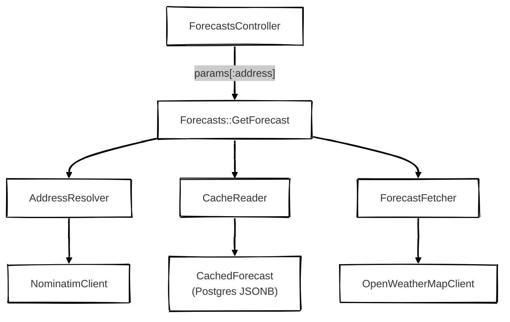

# Fetch Forecast

A Rails 7.2 weather forecast service. Given a US address, returns current weather conditions and a 5-day forecast with daily high/low. Responses are cached by ZIP code for 30 minutes; a visible indicator shows whether the result is fresh from the weather API or served from cache.

## Live demo

[https://fetch-forecast.onrender.com/](https://fetch-forecast.onrender.com/)

## Tech stack

- Ruby 3.4 / Rails 7.2
- PostgreSQL (JSONB column for cached forecast payloads)
- Faraday + faraday-retry for HTTP with automatic backoff on transient errors
- Bootstrap 5 via CDN for UI
- RSpec + WebMock + FactoryBot for testing
- External APIs: OpenStreetMap Nominatim (geocoding), OpenWeatherMap (forecast)

## Setup

### Prerequisites

- Ruby 3.4 (see `.ruby-version`)
- PostgreSQL 14+

### Install
```
git clone git@github.com:mandelbro/fetch-forecast.git
cd fetch-forecast
bundle install
```

### Environment variables

Copy `.env.example` to `.env` and fill in:

```
OPENWEATHERMAP_API_KEY=<your_key_here>
NOMINATIM_USER_AGENT="fetch-forecast/1.0 (your-email@example.com)"
```

### Database

```
bin/rails db:setup
```

### Run locally

```
bin/rails server
```

Visit http://localhost:3000.

## Running tests

```
bundle exec rspec
```

Expected output: `102 examples, 0 failures.`

All external HTTP calls are stubbed with WebMock. Tests never hit the real Nominatim or OpenWeatherMap APIs.

## Architecture



### Key design decisions

- Weather API: [OpenWeatherMap](https://openweathermap.org/) (free tier, widely used, reliable)
- Geocoding: [Nominatim](https://nominatim.org/) (free, no API key, handles US addresses well)
- Cache backend: PostgreSQL via ActiveRecord rather than Redis. The `CachedForecast` model stores forecast payloads as JSONB, which is persistent, queryable, and also demonstrates ActiveRecord proficiency.
- UI: Server-rendered ERB + Bootstrap 5 via CDN. No build tooling needed.
- Deployment: [Render.com](https://render.com/) via `render.yaml` and GitHub connection.

### How the pieces fit together

#### Value objects

`Result`, `ForecastError`, `Forecast` are immutable, frozen after construction. `Forecast` round-trips through JSONB via `from_hash`/`to_h`.

#### HTTP clients with Faraday + Faraday Retry, WebMock for testing

`NominatimClient`, `OpenWeatherMapClient` are thin Faraday wrappers with retry and backoff. Each handles its own error cases (rate limits, not found, unauthorized).

#### Services
- `Geocoding::AddressResolver#call(address)` resolves a free-form string to a 5-digit US ZIP.
- `Weather::ForecastFetcher#call(zip)` fetches current + 5-day data and aggregates 3-hour buckets into per-day high/low/conditions.
- `Forecasts::CacheReader` wraps `CachedForecast` with `read(zip)` and an idempotent `write(zip, hash)` via upsert.
- `Forecasts::GetForecast#call(address)` coordinates the full sequence: resolve address, check cache, fetch on miss, persist, return.

Each layer depends only on the layers below it, so everything is independently testable.

## Build notes

I focused on object decomposition, enterprise-grade design patterns, and testing, which meant a conservative feature set. A few things I deliberately left out that I'd address in production:

- US only. ZIP code validation enforces `\A\d{5}\z`. Inputs like `"90210-1234"` or `" 90210 "` get rejected. Production would normalize at the boundary (strip whitespace, truncate ZIP+4).
- No POST-Redirect-GET. Forecasts aren't bookmarkable. Splitting `#show` into `#create` (accepts address, redirects) and `#show` (reads ZIP from URL) would fix this.
- Table growth is unbounded. `CachedForecast` needs a scheduled cleanup job (Sidekiq + cron, or a rake task) to purge rows past expiry.

## What I'd do next

Roughly ordered by impact:

1. Address autocomplete: via JS Autocomplete library backed by a server-side Nominatim proxy to enable separate caching of autocomplete queries.
3. Two-tier cache with Redis in front of Postgres as an L1 hot cache. The Repository pattern in `CacheReader` makes this a single-class change.
4. Rate limiting via `rack-attack` on the forecast and autocomplete endpoints.
5. Observability via `ActiveSupport::Notifications.instrument` for telemetry, Rollbar or Sentry for exceptions.
6. Scheduled cleanup for stale `cached_forecasts` rows.
