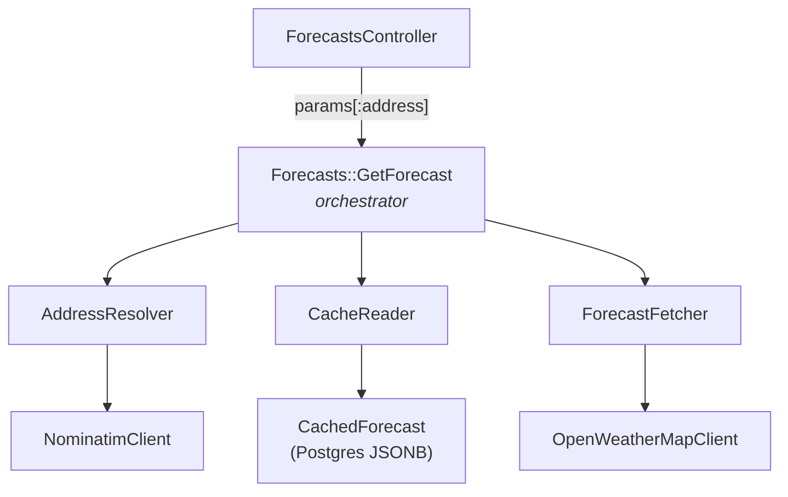

# Fetch Forecast

A Rails 7.2 weather forecast service. Given a US address, returns the current
conditions and a 5-day forecast with daily high/low. Responses are cached by
ZIP code for 30 minutes; a visible indicator shows whether the result is fresh
from the weather API or served from cache.

## Live demo

**[https://fetch-forecast-YOUR_SUBDOMAIN.onrender.com](#)**

> First request may take ~30 seconds to cold-start (Render free tier spins
> down after 15 min of inactivity). Subsequent requests are fast.

## Tech stack

- **Ruby** 3.4 / **Rails** 7.2
- **PostgreSQL** (JSONB column for cached forecast payloads)
- **Faraday** + **faraday-retry** for HTTP with automatic backoff on transient errors
- **Bootstrap 5** via CDN for UI
- **RSpec** + **WebMock** + **FactoryBot** for testing (~60 examples, zero real network calls)
- **External APIs:** OpenStreetMap Nominatim (geocoding), OpenWeatherMap (forecast)

## Setup

### Prerequisites

- Ruby 3.4 (see `.ruby-version`)
- PostgreSQL 14+

### Install
```
git clone git@github.com:mandelbro/fetch-forecast.git
cd fetch-forecast
bundle install
```

### Environment variables

Copy `.env.example` to `.env` and fill in:

```
  OPENWEATHERMAP_API_KEY=<your_key_here>
  NOMINATIM_USER_AGENT="fetch-forecast/1.0 (your-email@example.com)"
```

### Database

```
  bin/rails db:setup
```

### Run locally

```
  bin/rails server
```

Visit http://localhost:3000.

## Running tests

```
  bundle exec rspec
```

Expected output: **102 examples, 0 failures.**

All external HTTP calls are stubbed with WebMock. Tests never hit the real Nominatim or OpenWeatherMap APIs.

## Build notes

### Requirements
- Ruby on Rails application
- Input: an address (free-form string)
- Output: forecast with at minimum current temperature, bonus for 5 day forecast
- Cache forecast by zip code for 30 minutes
- Display a cached-vs-fresh indicator
- Include a UI
- Live deployment, resilient to breakage
- Public repo

### Design Considerations
- Enterprise-grade naming conventions
- Encapsulation (no god methods)
- Code reuse without over/under-engineering
- Testability

### Architectural Choices
- Weather API: [OpenWeatherMap](https://openweathermap.org/), free tier, widely known, reliable
- Address input: Free-form string with geocoding
- Geocoding: [Nominatim](https://nominatim.org/) free, no API key needed, good with US addresses
- UI: Server-rendered ERB + Bootstrap 5 via CDN, simple, looks good, no CSS
- Caching backend: PostgreSQL via ActiveRecord (`CachedForecast` model) Showcases SQL/AR skills the JD specifically called out. Persistent, queryable, and auditable
- Deployment: [Render.com](https://render.com/) easy to deploy via `render.yaml` and github connection

### Scope Boundaries

#### In scope
- Forecast retrieval and display
- 30-minute zip-code cache backed by `CachedForecast` AR model
- Free-form address input with jQuery UI autocomplete (backed by `Rails.cache` at the proxy layer)
- Current temperature + feels-like + today's high/low + 5-day extended
- Cache indicator with fetched-at timestamp and age display
- Error handling for: invalid address, geocoding failure, weather API failure
- Unit tests on all service objects, model specs, and request specs on controllers
- Live deployment to Render.com with PostgreSQL

#### Out of scope for this demo
- Authentication / user accounts
- Internationalization (US zip codes only)
- Favorites / saved locations
- Real-time updates / websockets
- Mobile-specific UI
- Backfill / seed data
- Scalability concerns (See Scalability Notes)
- Audit log of cache hit/miss events
- Prettier URLs via POST-Redirect-GET pattern (e.g., shareable `/forecast/:zip`)

## Object decomposition

The app is organized into five layers. Each layer depends only on the layers beneath it, which keeps the dependency graph acyclic and every component independently testable.

### 1. Value objects — `app/values/`

Immutable data-only classes. Frozen after construction.

| File | Responsibility |
|------|----------------|
| `result.rb` | `Result` — explicit `success?/failure?` wrapper. Every service returns one. Private constructor; factories (`Result.success`, `Result.failure`) enforce the invariant that
success-has-value and failure-has-error. |
| `forecast_error.rb` | `ForecastError` — structured error carrying a machine-readable `code`, a user-safe `user_message`, and an optional `log_detail` for server-side logs. Code validation
prevents typos. |
| `forecast.rb` | `Forecast` — typed representation of weather data. `from_hash` / `to_h` round-trip through JSONB. Extended array is deeply frozen to prevent post-construction mutation. |

### 2. Persistence — `app/models/`

| File | Responsibility |
|------|----------------|
| `cached_forecast.rb` | `CachedForecast` — single table, one row per ZIP. `forecast_data` is JSONB. `expires_at` drives the `fresh` / `stale` scopes. Validates ZIP format (`/\A\d{5}\z/`),
uniqueness, and `expires_at` future-ness via a comparison validator with a lambda (to re-evaluate `Time.current` per call, not at class load). |

### 3. HTTP clients — `app/services/*/…_client.rb`

Thin Faraday wrappers. Zero business logic; translate HTTP errors into
adapter-specific Ruby error classes that the caller can rescue.

| File | Responsibility |
|------|----------------|
| `geocoding/nominatim_client.rb` | `Geocoding::NominatimClient#search(address)` — returns parsed response Hash including `address.postcode`. US-only (`countrycodes=us`); sends required
`User-Agent` header per Nominatim TOS. Raises `NotFoundError`, `RateLimitError`, `ServiceError`. |
| `weather/open_weather_map_client.rb` | `Weather::OpenWeatherMapClient` — two methods (`current_weather`, `forecast`) over a shared private `get` helper. Sends API key as `appid` query param and
  `units=imperial`. Raises `NotFoundError`, `UnauthorizedError`, `RateLimitError`, `ServiceError`. |

Both clients retry transient failures (5xx, timeout, connection) via
`faraday-retry` with exponential backoff. 4xx responses bubble immediately.

### 4. Services — `app/services/`

Application logic. Each service has one public `.call` method. Dependencies
are constructor-injected for testability.

| File | Responsibility |
|------|----------------|
| `geocoding/address_resolver.rb` | `Geocoding::AddressResolver#call(address)` → `Result<String>` — address string to 5-digit US ZIP. Translates `NominatimClient` errors to `ForecastError` codes.
  |
| `weather/forecast_fetcher.rb` | `Weather::ForecastFetcher#call(zip)` → `Result<Forecast>` — fetches current + 5-day forecast and aggregates the 3-hour buckets into per-day high/low/conditions.
|
| `forecasts/cache_reader.rb` | `Forecasts::CacheReader` — repository over `CachedForecast`. `read(zip)` returns AR record or nil. `write(zip, hash)` is an idempotent `upsert` with `unique_by:
:zip_code`. |
| `forecasts/get_forecast.rb` | `Forecasts::GetForecast#call(address)` → `Result<Hash>` — orchestrates the full flow: resolve → check cache → fetch on miss → persist → return. |

### 5. Presentation — `app/controllers/`, `app/views/`

| File | Responsibility |
|------|----------------|
| `forecasts_controller.rb` | Thin controller. `#new` renders the form; `#show` reads `params[:address]`, calls `GetForecast`, maps failure codes to HTTP status (422 for user input, 503 for
service errors), re-renders form with error banner on failure. |
| `views/forecasts/new.html.erb` | Bootstrap-styled address input. Uses `form_with` and GET method for simple query-param submission. |
| `views/forecasts/show.html.erb` | Bootstrap-styled forecast page. Cached indicator badge uses `time_ago_in_words` for human-readable age. 5-day grid is responsive (2 cols mobile → 6 cols
desktop). |
| `views/layouts/application.html.erb` | Loads Bootstrap 5 via CDN. |

## Architecture


## Scalability considerations

The current implementation is sized for a take-home demo. In production, the
following would be layered in:

1. **Two-tier cache.** Keep Postgres as the source of truth (queryable,
    persistent, auditable) and put Redis in front as an L1 hot cache with
    matching TTL. The Repository pattern in `CacheReader` makes this a
    single-class change.

2. **Cache stampede mitigation.** When a popular ZIP's entry expires, N
    concurrent requests all miss and hit OpenWeatherMap. Mitigations:
    application-level advisory locking (`with_advisory_lock` gem), or a
    scheduled background refresh job that keeps hot ZIPs warm.

3. **Rate limiting.** The forecast endpoint is expensive (two external
    API calls per miss). `rack-attack` throttling per-IP would prevent abuse.
    Nominatim's 1 req/sec TOS limit is a separate concern for autocomplete
    (currently not implemented).

4. **Multi-provider failover.** The Adapter pattern makes swapping weather
    providers trivial. Production would keep two providers and fail over via
    a circuit breaker (e.g., the `stoplight` gem).

5. **Observability.** `ActiveSupport::Notifications.instrument` at the
    `CacheReader` and `ForecastFetcher` boundaries would emit hit/miss,
    latency, and failure metrics without coupling the services to a specific
    metrics backend.

6. **Scheduled cleanup.** `CachedForecast` grows unbounded without a cleanup
    pass. A scheduled task (Sidekiq + sidekiq-cron, or a rake task + cron)
    running `DELETE FROM cached_forecasts WHERE expires_at < NOW() - INTERVAL '7 days'`
    would bound table growth.

7. **Zip code normalization.** Currently enforced at the model layer
    (`/\A\d{5}\z/`). Inputs like `"90210-1234"` or `" 90210 "` would be
    rejected; production would normalize at the boundary (strip whitespace,
    truncate ZIP+4) before validation.

## Known quirks

- **"Location" in the response** — the displayed city comes from
  OpenWeatherMap's `name` field, which is OWM's nearest weather station, not
  the formal USPS city for the ZIP. For some border ZIPs (e.g., 95014 maps to
  "Sunnyvale" in OWM's data even though it's in Cupertino), the displayed
  city may differ from the city the user typed.

- **5-day vs 6-day display.** OpenWeatherMap returns 40 three-hour buckets
  across a rolling 5-day window starting from the current time. The buckets
  straddle the "first partial day" and the "last partial day", so the daily
  aggregation produces 5 or 6 daily entries depending on when the call is
  made. A day with only one bucket (e.g., the tail end of the window) may
  show identical high/low values.

- **Render cold start.** Free-tier web services spin down after 15 minutes
  of inactivity. The first request to a sleeping service takes ~30 seconds
  to wake. Subsequent requests are immediate.

## Assumptions and tradeoffs

### In scope
- US addresses only (`countrycodes=us` in Nominatim query)
- Fahrenheit (`units=imperial` in OpenWeatherMap query)
- Single-user, no authentication — public-facing demo
- 30-minute cache TTL, hard-coded as a constant in `CacheReader`

### Deliberately NOT in scope
- **Authentication / user accounts.** Not required by the spec; adds
  surface area without advancing the core goal.
- **jQuery UI autocomplete.** Considered and [architected](#what-id-do-next)
  but cut for scope. Would require a `Geocoding::SearchAddresses` service
  proxying Nominatim and a jQuery UI Autocomplete widget in the view.
- **Internationalization / non-US ZIPs.** US-only is explicit in the current
  scope. Extending would mean a different address-parsing strategy and a
  different postal-code validation.
- **Audit log of cache hits/misses.** A `ForecastLookup` model with a
  `belongs_to :cached_forecast` association would enable hit-rate analytics
  ("which ZIPs drive the most traffic?") and cache-ratio alerting. Cut for
  scope; see next-steps.
- **Shareable URLs via POST-Redirect-GET** (`/forecast/:zip` pattern).
  Current design uses `GET /forecast?address=...`. PRG with ZIP-based URLs
  would be bookmarkable/shareable but adds controller complexity without
  materially improving the demo UX.

## What I'd do next

Roughly ordered by impact:

1. **Address autocomplete** via jQuery UI Autocomplete + a
    `Geocoding::SearchAddresses` service that proxies Nominatim through the
    Rails app. Server-side proxy hides any future API keys, centralizes rate
    limiting, and enables separate caching of autocomplete queries.

2. **Audit log of cache hits/misses** via a `ForecastLookup` AR model with
    `belongs_to :cached_forecast`. Enables `GROUP BY zip_code` analytics for
    traffic patterns and `GROUP BY source` for hit-rate alerting.

3. **POST-Redirect-GET with shareable `/forecast/:zip` URLs.** Bookmarkable
    and cleaner REST semantics. Requires splitting `#show` into `#create`
    (accepts address, redirects) and `#show` (reads ZIP from URL).

4. **Two-tier cache with Redis in front of Postgres.** Described in
    Scalability #1.

5. **Scheduled cleanup job** for stale `cached_forecasts` rows.

6. **Rate limiting** via `rack-attack` on both the forecast endpoint and the
    (future) autocomplete endpoint.

7. **Multi-provider failover** for the weather API (OpenWeatherMap → NWS
    fallback).
